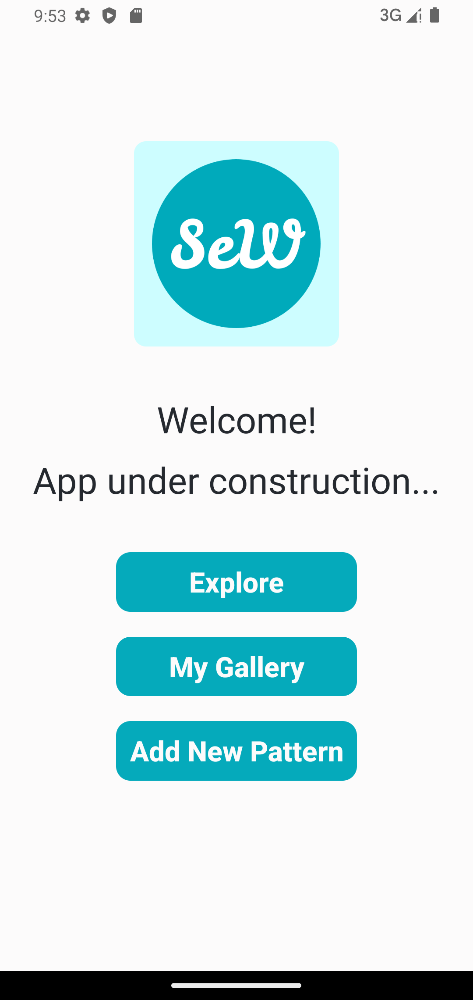
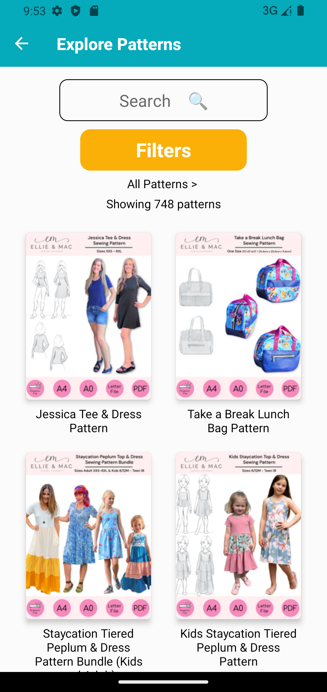
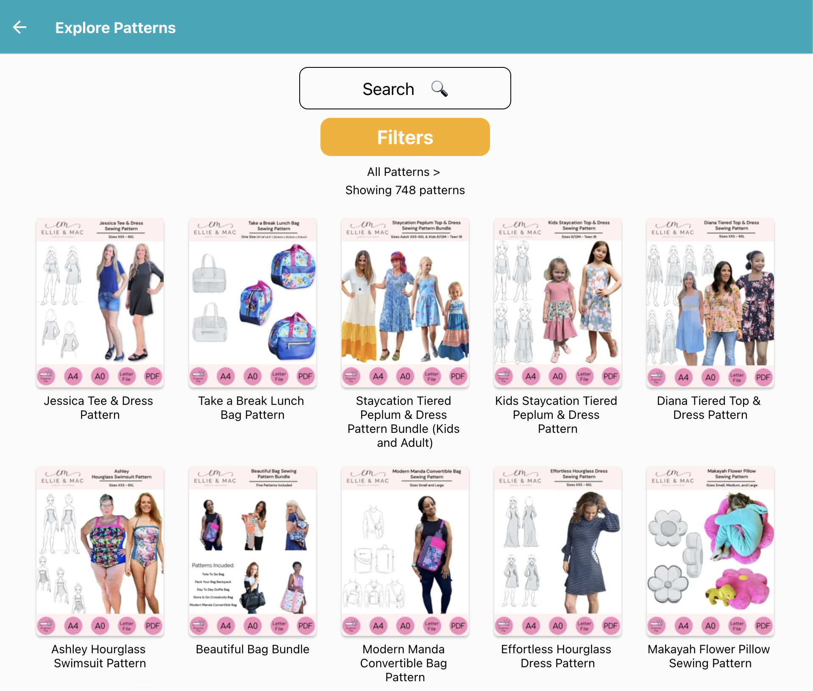

# Sew What Native app

## Description

  This is a passion project made to help me and other sewers keep all their digital sewing patterns in neat order.
  It also let's you search for and explore patterns from a few of the most popular online pattern creators and will let you save them to your collection.

## Tech Stack

- React Native
- Typescript
- Expo

### Planning Board & Design

[Color Template](https://huemint.com/website-1/#palette=fdfdfd-05aabc-f8ae06)

### Prototype

[Marvel Prototype](https://marvelapp.com/prototype/9f97jii/screen/91074177)

### Available at

[To be added later](.)

### Development Progress

**Version 0:**

**Version 0.1:**

Bare bones layout of Welcome Screen and Gallery

**Version 0.2:**

 Scrollabble galleries with patterns found online and users own patterns in Explore and My Patterns.

