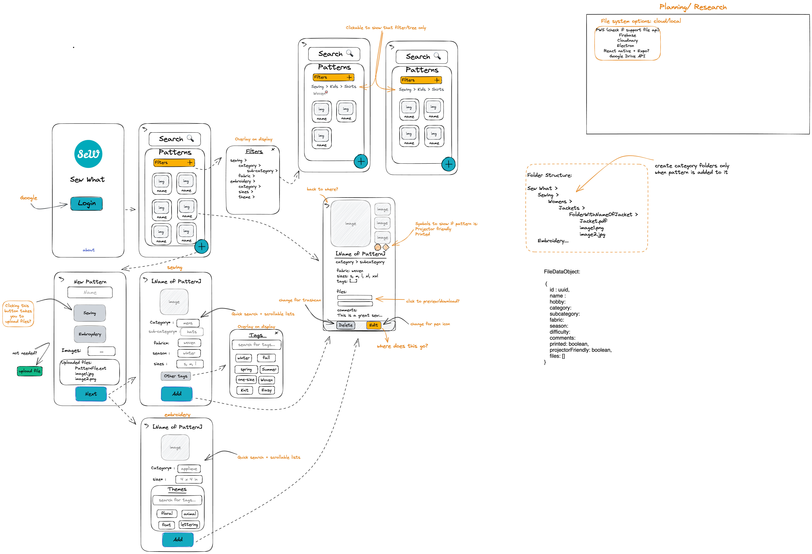
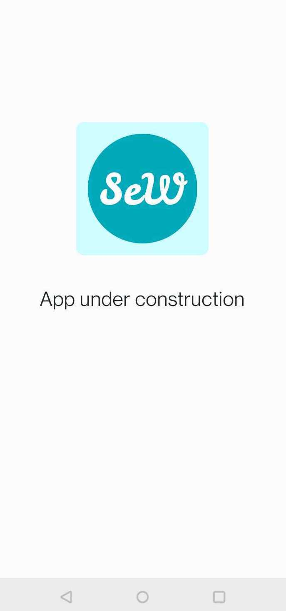
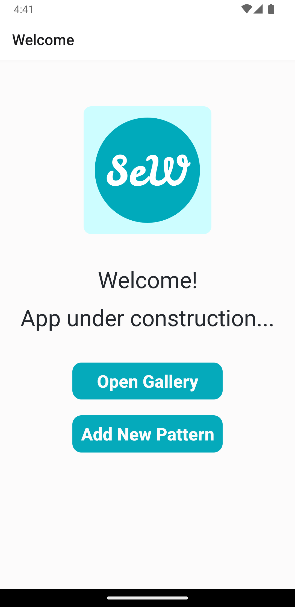
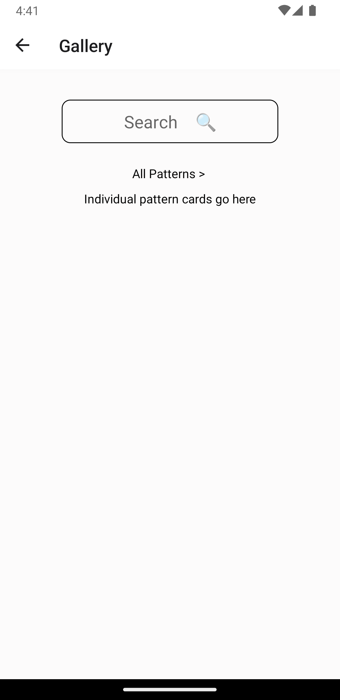

# Sew What Native app

## Description

  This is a passion project made to help me and other hobby-sewers keep all their digital hobby files in neat order.

## Tech Stack

- React Native
- Typescript
- Expo

### Planning Board & Design

[Color Template](https://huemint.com/website-1/#palette=fdfdfd-05aabc-f8ae06)

### Prototype

[Marvel Prototype](https://marvelapp.com/prototype/9f97jii/screen/91074177)

### Available at

[To be added later](.)

### Screenshots

**Version 0:**

**Version 0.1:**

